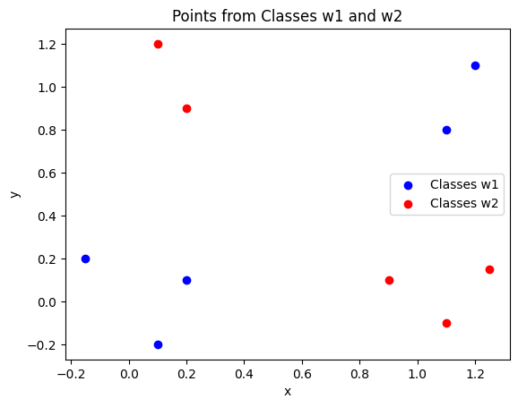
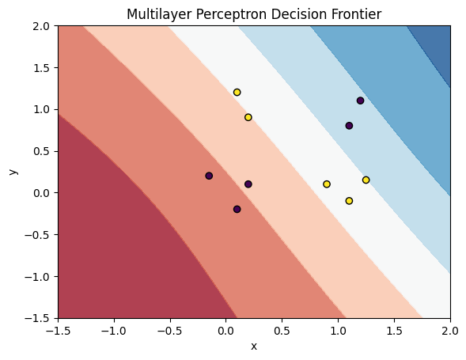
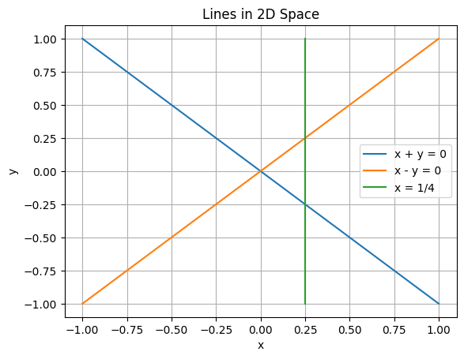

# Multilayer Perceptron Activity

## Overview

This repository contains the implementation of a Multilayer Perceptron (MLP) for classifying data points from two classes and solving specific problems related to perceptron learning. The tasks involve checking linear separability, visualizing decision boundaries, and analytically determining synaptic weights for a custom-designed neural network.

## Activity Description

### Task 1: Linear Separability and MLP Classification

#### Description
Given two sets of points defining two classes, the objective is to check if these points are linearly separable. If not, an MLP with logistic activation functions is designed manually to separate the points of the two classes.

#### Data Points

- **Class w1:**
  - \([0.1, -0.2]\)
  - \([0.2, 0.1]\)
  - \([-0.15, 0.2]\)
  - \([1.1, 0.8]\)
  - \([1.2, 1.1]\)

- **Class w2:**
  - \([1.1, -0.1]\)
  - \([1.25, 0.15]\)
  - \([0.9, 0.1]\)
  - \([0.1, 1.2]\)
  - \([0.2, 0.9]\)

#### Code Implementation

The code first visualizes the points, checks for linear separability, and then visualizes the decision boundary of the MLP.

### Task 2: Plotting Lines and Determining Polyhedra

#### Description
Plot three lines in a two-dimensional space:
- \(x + y = 0\)
- \(x = \frac{1}{4}\)
- \(x - y = 0\)

For each polyhedron formed by their intersections, determine the vertices of the cube in which they are mapped by the first layer of an MLP, with one neuron for each line. Combine the regions into two classes such that:
a) A two-layer network is sufficient to classify them.
b) A three-layer network is necessary to classify them.

Analytically determine the synaptic weights for both cases.

### Task 3: Multilayer Perceptron for Pattern Separation

#### Description
Consider patterns formed by two lines and two columns. Determine if these patterns are linearly separable. Design an MLP to separate these patterns.

### Task 4: Derivative of Tansig Activation Function

#### Description
Given the tansig activation function:
\[a = f(n) = \frac{e^n - e^{-n}}{e^n + e^{-n}}\]
Show that its derivative is:
\[f'(n) = 1 - a^2\]

## Results

The results include visualizations of the data points, decision boundaries, and analytical solutions for the specified tasks. Example outputs are provided in the notebook.

